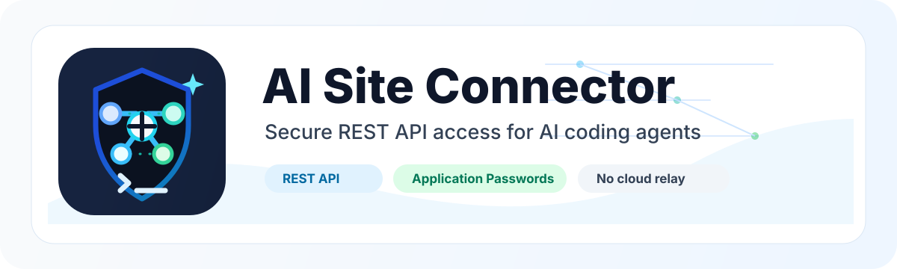

# AI Site Connector

<p align="center">
  
</p>

<p align="center">
  <strong>Secure REST API access for Claude, Codex, and other AI coding agents on self-hosted WordPress.</strong><br>
  No WordPress.com, no Jetpack, no backdoors - just WordPress core Application Passwords with admin-controlled setup.
</p>

[](https://github.com/tyhallcsu/ai-site-connector/actions/workflows/ci.yml)
[](https://github.com/tyhallcsu/ai-site-connector/actions/workflows/release-zip.yml)


[](https://opensource.org/licenses/MIT)

A WordPress plugin that lets Claude, Codex, and other AI coding agents authenticate to a self-hosted WordPress site over the REST API using **Application Passwords** — with **no WordPress.com account, no Jetpack, and no third-party cloud service** required.

> Built for site operators who manage many WordPress installs and want a clean, repeatable, least-privilege way to connect AI tooling for maintenance and content work.

---

## What this plugin does

1. Adds a **Tools → AI Site Connector** admin page with status cards, a setup wizard, credential management, and an audit log.
2. Registers a custom **AI Site Operator** role with sensible read/edit capabilities (no plugin/file/theme editing, no `manage_options`).
3. Provides a **wizard** to create a dedicated AI/service user (default username `ai-agent`) — or pick an existing user.
4. Generates **Application Passwords** using WordPress core (`WP_Application_Passwords`), shown **once**, never stored in plaintext.
5. Produces a copy-paste **connection pack** containing site URL, REST base, username, and password, plus curl / Python / JavaScript / Claude Code examples.
6. Exposes a small set of **REST endpoints** under `/wp-json/ai-site-connector/v1/` for safe, read-only diagnostics.
7. Maintains an **audit log** of plugin events (user creation, password generation, revocation, health access).
8. Ships **WP-CLI commands** under `wp ai-connector …`.

## When NOT to use this plugin

This plugin is best for **routine, scoped, auditable AI maintenance** — content edits, media uploads, comment moderation, role-bounded automation that you want to be able to revoke with one click. It is intentionally not the right tool for everything.

Use SSH / SFTP / WP-CLI directly when you need:

- **File editing** — theme, plugin, or `wp-config.php` changes. The REST API cannot touch files; that limit is by design and this plugin does not bypass it.
- **Recovering a broken site** — if WordPress is white-screening or fataling, REST is broken too. SSH is the only thing that still works.
- **Bulk database operations** — `wp db query "UPDATE ..."` will outpace 10,000 REST calls. WP-CLI runs in-process; REST has per-call HTTP overhead.
- **Server-level work** — PHP version, opcache, cron, error logs, host config. None of that is REST-reachable.
- **Performance-critical batch jobs** — for the same per-call-overhead reason as above.

Pick the right tool per task. If your AI agent genuinely needs the items above, give it scoped SSH access (with all the trust that implies) and keep this plugin for everything else.

## Why WordPress.com is not required

WordPress core has supported [Application Passwords](https://make.wordpress.org/core/2020/11/05/application-passwords-integration-guide/) since 5.6. They are first-class HTTP Basic Auth credentials that authenticate requests to `wp-json/wp/v2/*` and any third-party REST routes. WordPress.com / Jetpack / OAuth flows are unrelated — this plugin uses only what is already in your self-hosted WordPress install.

## How Application Passwords work

- An Application Password is a 24-character credential tied to a specific WordPress user.
- It can be passed via HTTP Basic Auth: `Authorization: Basic base64(username:application_password)`.
- It inherits the user's permissions — that is why this plugin recommends a dedicated low-privilege user.
- It can be revoked at any time, independently of the user's main login password.

---

## Installation

1. Copy the `ai-site-connector/` folder into `wp-content/plugins/` on your WordPress site.
2. Activate **AI Site Connector** in the Plugins screen.
3. Open **Tools → AI Site Connector**.
4. Confirm the connectivity checks (HTTPS, REST reachable, Application Passwords available).

You can also install via WP-CLI:

```bash
wp plugin activate ai-site-connector
```

## Updating

Once installed, the plugin self-updates from its GitHub releases — no manual re-upload required.

* **Dashboard → Updates** and the **Plugins** screen will show a new version automatically when a release is published at <https://github.com/tyhallcsu/ai-site-connector/releases>.
* **Tools → AI Site Connector → Updates card**: click *Check for updates now* to bypass the 6-hour cache, or *Update now* to install in place.
* **WP-CLI**: `wp plugin update ai-site-connector` works the same way as it does for WP.org plugins.
* **Auto-updates**: enable on the Plugins screen ("Enable auto-updates") to let WordPress install new releases unattended.

Optional `wp-config.php` constants:

```php
// Opt into pre-release tags (e.g. v0.2.0-beta.1). Default: stable only.
define( 'AI_SITE_CONNECTOR_UPDATE_PRERELEASE', true );

// Kill switch — no update hooks fire, no GitHub calls. Useful for managed hosts.
define( 'AI_SITE_CONNECTOR_UPDATE_DISABLE', true );
```

The updater queries `api.github.com` at most every 6 hours (anonymous, no token required) and caches failures for 30 minutes to stay under GitHub's rate limit. Every check, install, and failure is recorded in the plugin's audit log.

## Create an AI user

1. Open **Tools → AI Site Connector → Setup Wizard**.
2. Pick a username (default `ai-agent`).
3. Pick a role. Recommended: **AI Site Operator** (least privilege). Choose **Editor** if the agent needs to manage other authors' content. Avoid **Administrator** unless you really need it — the plugin warns you when you do.
4. Submit — the plugin creates the user with a strong random login password (you do not need it; the AI will use an Application Password).

Or via WP-CLI:

```bash
wp ai-connector create-user --username=ai-agent --role=ai_site_operator
```

## Generate a connection pack

1. Go to **Tools → AI Site Connector → Credentials**.
2. Pick the AI user.
3. Click **Generate Connection Pack**.
4. Pick the tab for the tool you're wiring up — each one gives you a ready-to-paste snippet:
   * **Claude Desktop (MCP)** — `claude_desktop_config.json` block with your site URL, username, and Application Password baked in as env vars.
   * **Cursor / VS Code (MCP)** — same shape for `.cursor/mcp.json` (or any IDE that speaks MCP).
   * **n8n / Make.com / Zapier** — plain-text Basic Auth credential instructions for the three most common no-code automation platforms.
   * **curl / Python (requests) / Node.js (fetch)** — quick sanity-check snippets.
   * **connection-pack.json** — the generic structured pack for anything else.
   * **Agent instructions (plain text)** — drop into a system prompt or onboarding doc.
5. Save the password in your password manager. You cannot view it again.

Or via WP-CLI:

```bash
wp ai-connector generate-password --username=ai-agent --format=json
```

## Health check / self-test (for CI, Ansible, cron)

```bash
# Quick checks — role caps, audit table, App Passwords available, /v1/health payload shape:
wp ai-connector self-test

# End-to-end: also mints a temporary Application Password for ai-agent,
# uses it against /wp-json/wp/v2/users/me, and revokes it.
wp ai-connector self-test --username=ai-agent

# Machine-readable output, exits non-zero on any failure:
wp ai-connector self-test --username=ai-agent --format=json
```

The self-test never prints the temporary password and revokes it on every exit path (including a fatal error mid-test). Successful runs are recorded in the audit log as `self_test_run`.

## How Claude / Codex should authenticate

Agents send standard HTTP Basic Auth on every REST request. The connection pack tells the agent everything it needs:

```json
{
  "site_name": "Example",
  "site_url": "https://example.com",
  "rest_api_base": "https://example.com/wp-json/",
  "auth_method": "basic_auth_application_password",
  "username": "ai-agent",
  "application_password": "DISPLAY_ONCE_ONLY",
  "test_endpoint": "https://example.com/wp-json/wp/v2/users/me",
  "plugin_health_endpoint": "https://example.com/wp-json/ai-site-connector/v1/health",
  "notes": "Use HTTP Basic Auth with username and application password."
}
```

### curl

```bash
curl -u 'ai-agent:xxxx xxxx xxxx xxxx xxxx xxxx' \
  'https://example.com/wp-json/wp/v2/users/me'
```

### Python

```python
import requests
r = requests.get(
    "https://example.com/wp-json/wp/v2/users/me",
    auth=("ai-agent", "xxxx xxxx xxxx xxxx xxxx xxxx"),
    timeout=15,
)
print(r.status_code, r.json())
```

### JavaScript

```js
const auth = "Basic " + btoa("ai-agent:xxxx xxxx xxxx xxxx xxxx xxxx");
const r = await fetch("https://example.com/wp-json/wp/v2/users/me", {
  headers: { Authorization: auth },
});
console.log(r.status, await r.json());
```

### Claude Code instructions

Paste this into your Claude Code session or system prompt:

```
You can authenticate to this WordPress site using HTTP Basic Auth.
- REST base: https://example.com/wp-json/
- Username: ai-agent
- Password: (Application Password from the connection pack)
Add header: Authorization: Basic base64(username:application_password)
Plugin health endpoint: https://example.com/wp-json/ai-site-connector/v1/health
Do not commit this password to git.
```

### Cookbook

[**docs/COOKBOOK.md**](docs/COOKBOOK.md) has copy-paste curl + Python recipes for the 10 most common AI tasks: capability introspection, list/create/update/publish posts, upload media, set featured image, search, edit pages, moderate comments, and plugin health checks. Each recipe lists the required capability and the common failure modes.

### Bootstrap prompt for AI agents

[**examples/agent-bootstrap-prompt.md**](examples/agent-bootstrap-prompt.md) is a paste-into-Claude/Codex/Cursor system-prompt template that hands the AI agent everything it needs: connection details (with placeholders for the four values the plugin gave you), the recommended first three calls, the capability map, what NOT to try, error reference, and operating-posture rules. Use this when onboarding a new agent to a freshly-installed site.

---

## REST endpoints (added by this plugin)

All endpoints under `/wp-json/ai-site-connector/v1/`.

| Endpoint     | Auth                                       | Returns                                                      |
| ------------ | ------------------------------------------ | ------------------------------------------------------------ |
| `/health`           | Public (minimal payload; richer if authenticated) | Plugin version, site URL, REST URL, HTTPS, timestamp. Authenticated callers also see WP/PHP versions, theme, plugin count, multisite flag, and current user. |
| `/me/capabilities`  | Any authenticated user                     | Calling user's `user_id`, `login`, `roles`, `capabilities` map, `operator_role_active`. Never reveals another user's permissions. Extend the cap list via the `ai_site_connector_introspection_caps` filter. |
| `/site-info`        | Authenticated, `edit_posts`                | Site name, URL, language, theme, multisite flag              |
| `/plugins`   | Authenticated, `manage_options`            | List of installed plugins (read-only)                        |
| `/themes`    | Authenticated, `manage_options`            | List of installed themes (read-only)                         |
| `/pages`     | Authenticated, `edit_pages`                | First 200 pages (id/title/slug/status)                       |
| `/posts`     | Authenticated, `edit_posts`                | Up to 50 most recent posts                                   |

There are intentionally **no write endpoints, no file editor, no SQL exec, no plugin installer**. Use the standard WordPress REST API (`/wp-json/wp/v2/*`) for content writes.

---

## Security best practices

- **Use HTTPS.** This plugin refuses to mint Application Passwords over plain HTTP unless you explicitly set `define('AI_SITE_CONNECTOR_ALLOW_HTTP', true)` or `WP_DEBUG` is true (for local dev only).
- **Use the AI Site Operator role**, not Administrator.
- Treat connection packs like passwords: store in 1Password / Bitwarden / Vault, **never** in git.
- Rotate Application Passwords on a schedule. The plugin makes revoke easy.
- Watch the audit log under **Tools → AI Site Connector → Audit Log**.
- If the site is behind Cloudflare or a WAF, allowlist the AI IP range — many WAFs block the `Authorization` header by default.

## Recommended role / capability setup

The default capabilities of `ai_site_operator` are intentionally conservative. By default the role grants:

- `read`, `edit_posts`, `edit_pages`
- `edit_published_posts`, `edit_published_pages`
- `upload_files`
- `moderate_comments`

By default the role does **not** grant:

- `list_users`, `edit_others_posts`, `edit_others_pages`
- Any `delete_*` capability
- Any plugin / theme / file / user / option management capability

Extend with the filter — for example, to let the AI revise content authored by humans, list users, or publish on its own:

```php
add_filter( 'ai_site_connector_operator_caps', function ( $caps ) {
    $caps['edit_others_posts']   = true;
    $caps['edit_others_pages']   = true;
    $caps['list_users']          = true;   // also unlocks /site-info for legacy callers
    $caps['publish_posts']       = true;
    return $caps;
} );
```

Each capability you add expands the agent's authority. Keep the diff minimal.

## Administrator role gate

If you select **Administrator** in the wizard, the plugin requires you to type the phrase

```
I UNDERSTAND THIS GRANTS FULL SITE ACCESS
```

into a confirmation field before it will create the user. The same phrase is enforced server-side, so manipulating the form via DevTools does not bypass it. A refused attempt is recorded in the audit log as `ai_user_admin_refused`.

## Building a release ZIP

Official plugin ZIPs are published from [GitHub Releases](https://github.com/tyhallcsu/ai-site-connector/releases). The repository also ships a `workflow_dispatch` workflow at `.github/workflows/release-zip.yml` for rebuilding a checked release artifact from CI.

To build locally:

```bash
bin/build-release-zip.sh
tests/package-smoke.sh
```

## How to revoke access

- Open **Tools → AI Site Connector → Credentials**, click **Revoke** on the row.
- Or `wp ai-connector revoke-password --username=ai-agent --uuid=<uuid>`.
- Or open the user's profile in `/wp-admin/users.php` and revoke from the **Application Passwords** section. Both UIs operate on the same WP core data.

## Troubleshooting

**REST API disabled** — Some security plugins (iThemes Security, Wordfence) can disable the REST API for non-logged-in users. Whitelist `/wp-json/` and ensure the `Authorization` header is allowed.

**HTTPS missing** — Configure SSL on the host (Let's Encrypt, Cloudflare Origin Cert, etc.) before going to production.

**Application Passwords unavailable** — The feature may be turned off via the `wp_is_application_passwords_available` filter. Re-enable it, or check that you are on WP 5.6+.

**Basic Auth blocked** — Some hosts strip the `Authorization` header at Apache/nginx. Add this to `.htaccess`:

```
RewriteEngine On
RewriteCond %{HTTP:Authorization} ^(.*)
RewriteRule .* - [E=HTTP_AUTHORIZATION:%1]
```

**401 unauthorized** — Verify the username, that the Application Password is correct, and that the user has not been deleted/disabled.

**403 forbidden** — The user does not have the capability required for that endpoint. Check the role.

**Cloudflare / WAF blocking** — Disable Cloudflare's "Block Authorization Header" rules for `/wp-json/*`. In the WordPress firewall, allow the AI's IP, or temporarily switch Cloudflare into Development Mode while testing.

---

## Brand assets

- `assets/brand/ai-site-connector-mark.svg` — compact icon/mark; **shipped at runtime** (rendered by the Tools → AI Site Connector admin page header).
- `assets/brand/ai-site-connector-logo.svg` — horizontal logo with wordmark; for README, repo, social previews.
- `assets/brand/ai-site-connector-readme-banner.svg` — README banner with the tagline "Secure REST API access for AI coding agents".
- `assets/brand/ai-site-connector-logo-256.png` / `-logo-512.png` / `-banner.png` — optional PNG exports for surfaces that don't render SVG (excluded from the plugin install ZIP to keep the distribution lean).

The assets are original vector artwork authored for this repo. They contain no embedded stock images, no copied third-party logos, and no trademarked logo reuse. Released under the same [MIT License](LICENSE) as the rest of the plugin — fork, modify, ship.

See [docs/BRAND_ASSETS.md](docs/BRAND_ASSETS.md) for file notes and PNG export commands.

---

## Removal / rollback

Standard WordPress plugin removal:

```bash
wp plugin deactivate ai-site-connector
wp plugin delete ai-site-connector
```

By default deletion **preserves** the audit log table, the AI Site Operator role, the dedicated AI user, and any Application Passwords. That's intentional — content the AI created may still be authored by that user, and credentials should be managed independently of plugin lifecycle.

If you want a clean wipe of the data this plugin owns when it is deleted, opt in via either:

1. **Tools → AI Site Connector → Audit → Plugin removal** — tick "On uninstall, drop the audit log table…" and save.
2. **wp-config.php constant** — useful for managed installs where you don't want admins clicking through:
   ```php
   define( 'AI_SITE_CONNECTOR_WIPE_ON_UNINSTALL', true );
   ```
   The constant LOCKS the option ON; the admin checkbox becomes read-only.

When opted in, `wp plugin delete ai-site-connector` will:

- DROP the `{prefix}ai_site_connector_log` table.
- Remove the `ai_site_operator` role.
- Delete the `ai_site_connector_db_version`, `ai_site_connector_log_retention_days`, and `ai_site_connector_wipe_on_uninstall` options.
- Unschedule the daily prune cron.

It will **NOT** delete:

- The dedicated AI user — they may own posts, media, or comments. Remove with `wp user delete ai-agent --reassign=1` if you want them gone.
- Application Passwords — managed by WordPress core. Revoke individually with `wp user application-password delete <user> <uuid>` or by deleting the user.

---

## License

MIT © 2026 sharmanhall — see [LICENSE](LICENSE).

This plugin ships with no warranty. Audit before use on production sites.
